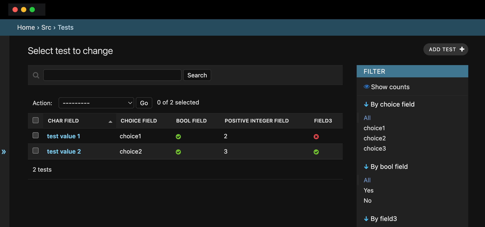
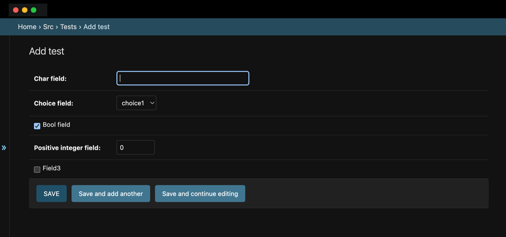

# You can actually create a quick list view and create / update form for your model using the admin site generator

Lets see how to do that. Please note that this is something you will use in your developer machine. The admin site is not available when you run your app in PROD mode

### Step 1: Define Your Model

Ensure your `Test` model is defined in your `models.py` file:

```python
from ginger.db import models

CHOICES = (
    ('choice1', 'Choice 1'),
    ('choice2', 'Choice 2'),
)

class Test(models.Model):
    """test"""

    choice_field = models.CharField(null=True, choices=CHOICES, max_length=50, default="choice1")
    bool_field = models.BooleanField(default=True)
    char_field = models.CharField(null=True, max_length=50)
    positive_integer_field = models.PositiveIntegerField(null=False, default=0)
    field3 = models.BooleanField(default=False)

    def __str__(self):
        return self.char_field or "Unnamed Test"
```

### Step 2: Register the Model with the Admin Site

Create an admin configuration for the `Test` model in your `admin.py` file:

```python
from ginger.contrib import admin
from .models import Test

@admin.register(Test)
class TestAdmin(admin.ModelAdmin):
    list_display = ('char_field', 'choice_field', 'bool_field', 'positive_integer_field', 'field3')
    list_filter = ('choice_field', 'bool_field', 'field3')
    search_fields = ('char_field',)
    ordering = ('char_field',)
    fieldsets = (
        (None, {
            'fields': ('char_field', 'choice_field', 'bool_field', 'positive_integer_field', 'field3')
        }),
    )

# Alternatively, you can register the model without the decorator
# admin.site.register(Test, TestAdmin)
```

### Explanation

- **list_display**: Defines the fields to display in the list view of the admin site.
- **list_filter**: Adds filter options in the sidebar of the list view.
- **search_fields**: Enables a search box for the specified fields.
- **ordering**: Defines the default ordering of the list view.
- **fieldsets**: Organizes the fields into sections on the model's edit page.

### Step 3: Access the Admin Interface

Start your ginger development server and log in to the admin site. You should see the `Test` model listed there with the configured options.

```bash
python manage.py runserver
```

Visit `http://127.0.0.1:8000/admin/`. The `Test` model should now be available for management.




